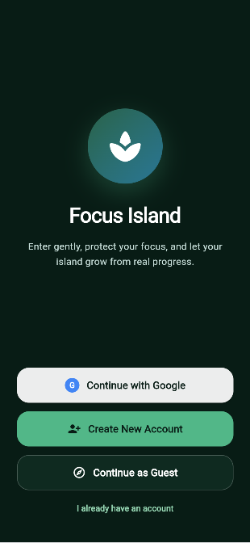
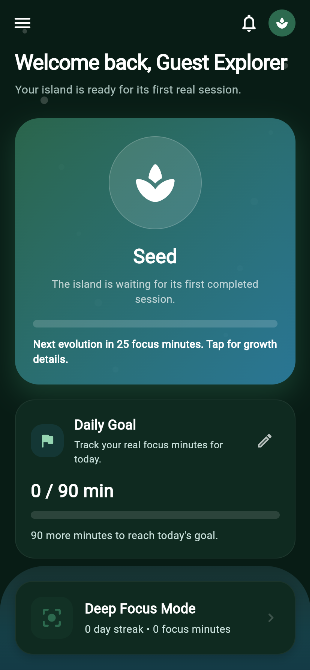
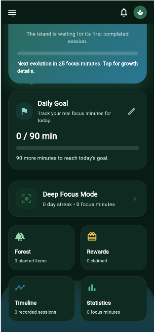
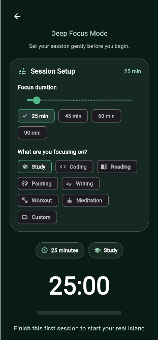
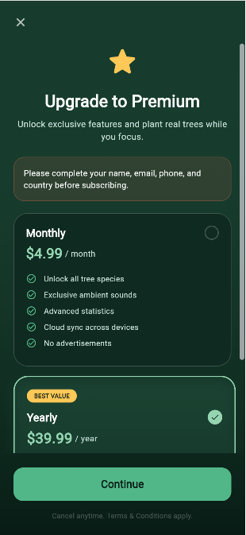
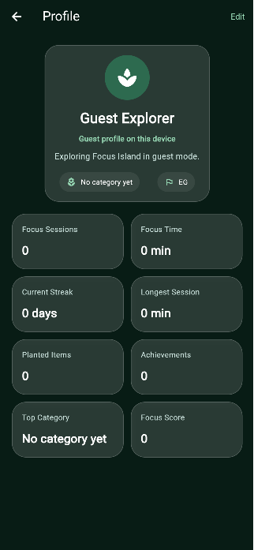

# 🌿 Focus Island

> A productivity app that turns your focus into growth 🌱

---

##  Concept

Focus Island helps you build deep focus habits by turning your sessions into visual progress.

Every session = growth  
Every streak = evolution  

---

##  Current Version

---

##  Features

###  Core
-  Deep Focus Sessions  
-  Growth System (Plant / Island Evolution)  
-  Rewards System  
-  Local Progress Tracking  
-  Real Forest Progress System  
-  Daily Rewards  
-  Island-based Focus Experience  

###  User System
-  Profile Screen  
-  Edit Profile  
-  Onboarding Flow  
-  Guest Mode (in progress)  
-  Login System (upgrading)  
-  Premium Screen  
-  Subscription Flow Integration (in progress)  

###  UI/UX
-  Clean Navigation  
-  Activated Buttons  
-  Removed Fake Data  
-  Honest UX Experience  
-  Improved Screen Structure  
-  Better User Flow  
-  More Polished App Sections  

---

## 🔄 Version History

### 🟢 v2.0
-  Added onboarding flow  
-  Added Premium screen  
-  Improved app structure and navigation  
-  Connected main screens with providers  
-  Added daily rewards flow  
-  Enhanced real forest system  
-  Improved island experience foundation  
-  Prepared payment/subscription integration flow  
-  Better scalable project organization  

### 🟢 v1.5
-  Activated navigation  
-  Added Profile & Edit Profile  
-  Improved Settings  
-  Removed fake leaderboard  
-  Real local forest logic  

### ⚪ v1.0
- Initial UI  
- Basic focus system  
- Demo features  

---

## 📌 Roadmap

### 🔜 Coming Next
-  Google Sign-In  
-  Full Authentication System  
-  Advanced Growth System  
-  UI Enhancements  
-  Cloud Sync  
-  Payment Activation  
-  Premium Subscription Logic  
-  Stronger Data Persistence  
-  More Tree Types and Island Visual Expansion  

---

## 🛠️ Tech Stack

---

## 📸 Screenshots

### Onboarding & Entry

  

Initial entry screen with multiple access options including Google sign-in, account creation, and guest mode.

---

### Island Home Experience

  
  

Main island dashboard showing current growth stage, daily goal tracking, and quick access to core features.

---

### Deep Focus Setup

  

Focus session setup interface where users select duration and define what they want to focus on.

---

### Navigation Drawer

  

Side navigation menu providing access to different sections such as forest, focus mode, timeline, statistics, and settings.

---

### Premium Upgrade

  

Premium subscription screen showing plans, features, and upgrade options.

---

### Focus Session

  

Active focus session with timer tracking and session controls.

---

### Profile & Progress

  

User profile displaying statistics, progress, and achievements.

---

### Ambient Sounds

  

Ambient sound controls designed to enhance focus sessions with calming audio.

---

##  Future Vision

-  Global Leaderboard  
-  Social System  
-  Achievements Expansion  
-  Premium Features  
-  Cross-device Sync  
-  Immersive Island World  
-  Real Growth Journey for Every User  

---

## 👨‍💻 Author

**Youssef (youssef_dev)**  
💡 Passionate about building meaningful apps  

---

## 🌱 Project Status

Actively improving in phases alongside academic schedule.
