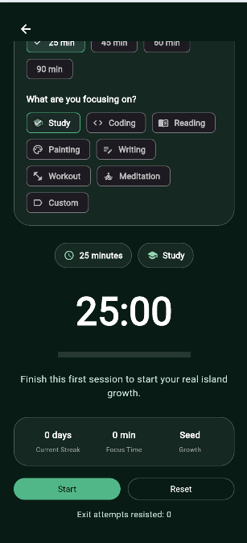
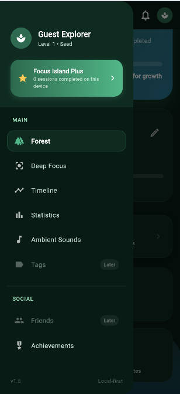
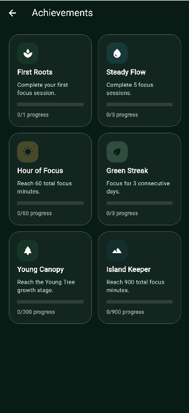
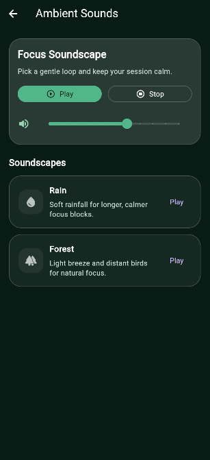

# 🌿 Focus Island

  <b>A productivity app that turns your focus into real, visible growth 🌱</b> 
  <i>Not just tracking time… but building a world.</i>

---

## ⚡ Why Focus Island?

Most productivity apps track time.
**Focus Island transforms it.**

Every focus session contributes to something bigger:
🌱 Your island grows
🌳 Your effort becomes visible
🏝️ Your discipline builds a world

> **Focus is no longer abstract — it becomes something you can see.**

---

## 🧠 Concept

Focus Island is built on a simple idea:

* Every session = **Growth**
* Every streak = **Evolution**
* Every user = **A unique island**

This creates a loop of:

> **Effort → Reward → Motivation → More Effort**

---

## 🚀 Current Version

  
  
  
  

---

## ✨ Features

### 🔥 Core Experience

* Deep Focus Sessions
* Island Growth System (Visual Progress 🌱 → 🌳)
* Rewards & Achievements
* Daily Rewards System
* Real Forest Progress Tracking
* Island-based immersive experience

### 👤 User System

* Profile & Edit Profile
* Onboarding Flow
* Guest Mode *(in progress)*
* Authentication System *(upgrading)*
* Premium System
* Subscription Flow *(in progress)*

### 🎨 UI/UX Improvements

* Clean & structured navigation
* Honest UX (no fake data)
* Improved screen flow
* More polished interactions
* Better app consistency

---

## 📸 Screenshots

### 🟢 First Impression (Onboarding)

  

---

### 🏝️ Island Experience

  
  

---

### 🎯 Focus Setup

  
  

---

### 🧭 Navigation System

  

---

### 💎 Premium

  

---

### 👤 Profile

  

---

### 🏆 Achievements

  

---

### 🎧 Ambient Sounds

  

---

## 🔄 Version History

### 🟢 v2.0 (Current)

* Introduced onboarding flow
* Added Premium system
* Integrated providers with main screens
* Daily rewards logic
* Real forest system improvements
* Prepared subscription/payment flow
* Scalable architecture improvements

### 🟢 v1.5

* Navigation activation
* Profile system
* Settings improvements
* Removed fake leaderboard
* Real local forest logic

### ⚪ v1.0

* Initial UI
* Basic focus system

---

## 🛠️ Tech Stack

  
  
  
  

---

## 🔮 Roadmap

### 🚧 Next Phase

* Google Sign-In
* Full Authentication System
* Cloud Sync
* Payment Activation
* Premium Logic Completion
* Advanced Data Persistence

### 🌍 Future Vision

* Global Leaderboard
* Social Features
* Expanded Achievement System
* More Trees & Island Elements 🌳🌊
* Fully immersive island world

---

## 🌱 Project Philosophy

> This app is built around one belief:

**“Consistency builds worlds.”**

Focus Island aims to make discipline:

* Visible
* Rewarding
* Addictive (in a good way)

---

## 👨‍💻 Author

**Youssef (youssef_dev)**
Building meaningful products with real impact 🚀

---

## ⭐ Support

If you like the project, consider giving it a ⭐
It helps more than you think.

---

## 📌 Status

  

Actively evolving alongside real-world usage and learning journey.
